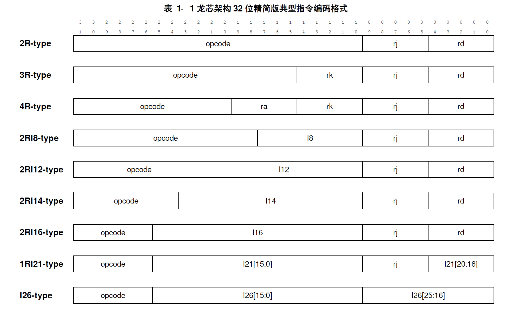

## 指令完成情况

#### op6

- [x] `0 1 0`  开头，`0 1 1` - `1 1 1`。共 5 项：**jirl, b, bl, beq, bne**
- [x] `0 1 1` 开头，`0 0 0` - `0 1 1`。共 4 项：**blt, bge, bltu, bgeu**

#### op7

- [x] `0 0 0 1` 开头，`0 1 0`, `1 1 0`。共 2 项：**lu12i.w, pcaddu12i**

#### op10

- [x] `0 0 0 0 0 0 1` 开头， `0 0 0` - `1 1 1` 中间有缺项。 共 6 项：**slti, sltui, addi.w andi, ori, xori**

- [x] `0 0 1 0 1 0 0` 开头，`0 0 0` - `1 1 0`。共 6 项：**ld.b, ld.h, ld.w, st.b, st.h, st.w**
- [x] `0 0 1 0 1 0 1` 开头，`0 0 0` - `0 0 1`。共 3 项：**ld.bu, ld.hu**, preld

#### op17

- [x] `0 0 0 0 0 0 0 0 0 0 0 1` 开头，`0 0 0 0 0` - `1 0 0 0 0`  中间有缺项。共 11 项：**add.w, sub.w, slt, sltu, nor, and, or, xor, sll.w, srl.w, sra.w**
- [ ] `0 0 0 0 0 0 0 0 0 0 0 1` 开头，`1 1 0 0 0` - `1 1 0 1 0` 。共 3 项：mul.w, mulh.w, mulh.wu
- [ ] `0 0 0 0 0 0 0 0 0 0 1 0` 开头，`0 0 0 0 0` - `0 0 0 1 1`。共 4 项：div.w, mod.w, div.wu, mod.wu 
- [x] `0 0 0 0 0 0 0 0 0 1 0 0` 开头，`0 0` - `1 0` + `0 0 1`。共 3 项：**slli.w, srli.w, srai.w**
- [ ] `0 0 1 1 1 0 0 0 0 1 1 1` 开头，`0 0 1 0 0` - `0 0 1 0 1` 。共 2 项：dbar, ibar

#### op22

- [ ] `0 0 0 0 0 0 0 0 0 0 0 0 0 0 0 0 0`  开头。共 3 项：rdcntid.w, rdcntvl.w, rdcntvh.w

#### alu_op

add.w, addi.w, pcaddu12i, ld.b, ld.h, ld.bu, ld.hu, ld.w, st.b, st.h, st.w, b, bl, jirl

sub.w

slt, sltu, stli, sltui

and, andi

nor

or, ori

xor, xori

sll.w, slli.w

srl.w, srli.w

sra.w, srai.w

lui12i.w

## 简单整理

### 算数运算类

| √    | 指令      | 格式                | 说明                                        |
| ---- | --------- | ------------------- | ------------------------------------------- |
| √    | ADD.W     | add.w rd, rj, rk    |                                             |
| √    | SUB.W     | sub.w rd, rj, rk    |                                             |
| √    | ADDI.W    | addi.w rd, rj, si12 | si12 符号扩展 32 位                         |
| √    | LU12I.W   | lu12i.w rd, si20    | 将 si20 最低位连接 12'b0 符号扩展           |
| √    | SLT       | slt rd, rj, rk      | 如果前者小于后者 GR[rd] 置 1                |
| √    | SLTU      | sltu rd, rj, rk     |                                             |
| √    | SLTI      | slt i rd, rj, si12  |                                             |
| √    | SLTUI     | sltu i rd, rj, si12 |                                             |
| √    | PCADDU12I | pcaddu12i rd, si20  | 最低位连接 12'b0                            |
| √    | AND       | and rd, rj, rk      |                                             |
| √    | OR        | or rd, rj, rk       |                                             |
| √    | NOR       | nor rd, rj, rk      |                                             |
| √    | XOR       | xor rd, rj, rk      |                                             |
| √    | ANDI      | and i rd, rj, ui12  | ui12 立即数零扩展                           |
| √    | ORI       | ori rd, rj, ui 12   |                                             |
| √    | XORI      | xori rd, rj, ui12   |                                             |
| -    | NOP       | andi r0, r0, 0      |                                             |
|      | MUL.W     | mul.w rd, rj, rk    | 操作数视为有符号数，结果符号扩展            |
|      | MULH.W    | mulh.w rd, rj, rk   | 操作数视为有符号数，结果的 [63:32] 符号扩展 |
|      | MULH.WU   | mulh.wu rd, rj, rk  | 操作数视为无符号数                          |
|      | DIV.W     | div.w rd, rj, rk    | 操作数视为有符号数，结果符号扩展            |
|      | MOD.W     | mod.w rd, rj, rk    |                                             |
|      | DIV.WU    | div.wu rd, rj, rk   | 操作数视为无符号数                          |
|      | MOD,WU    | mod.wu rd, rj, rk   |                                             |

### 移位运算类

| √   | 指令    | 格式                | 说明                                |
| ------- | ------------------- | ----------------------------------- | ----------------------------------- |
| √  | SLL.W   | sll.w rd, rj, rk    | 逻辑左移，结果符号扩展，GR\[rk][4:0] |
| √  | SRL.W   | srl.w r d, rj, rk   |                                     |
| √  | SRA.W   | sra.w rd, rj, rk    | 算数右移，结果符号扩展              |
| √ | SLLI.W  | slli.w rd, rj, ui5  |                                     |
| √ | SRLI.W  | srli.w rd, rj, ui5  |                                     |
| √ | SRAI.W  | srai.w rd, rj, ui5  |                                     |

### 转移指令

| √    | 指令 | 格式                 | 说明               |
| ---- | ---- | -------------------- | ------------------ |
| -    | BEQ  | beq rj, rd, offs16   |                    |
| -    | BNE  | bne rj, rd, offs16   |                    |
| -    | BLT  | blt rj, rd, offs16   | 操作数视为有符号数 |
| -    | BGE  | bge rj, rd, offs16   | 操作数视为有符号数 |
| -    | BLTU | bltu rj, rd, of fs16 |                    |
| -    | BGEU | bgeu rj, rd, offs16  |                    |
| √    | B    |                      |                    |
| √    | BL   |                      |                    |
| √    | JIRL |                      |                    |

### 访存指令

| √      | 指令       | 格式 | 说明 |
| ---------- | ---- | ---- | ---- |
| √ | LD.B |      |      |
| √ | LD.H |      |      |
| √ | LD.W |      |      |
| √ | LD.BU |      |      |
| √ | LD.HU |      |      |
| √ | ST.B |      |      |
| √ | ST.H |      |      |
| √ | ST.W |      |      |
|  | PRELD |      |      |

### 原子访存指令

| √      | 指令       | 格式 | 说明 |
| ---------- | ---- | ---- | ---- |
|  | LL.W |      |      |
|  | SC.W |      |      |

### 栅障指令

| √      | 指令       | 格式 | 说明 |
| ---------- | ---- | ---- | ---- |
|  | DBAR |      |      |
|  | IBAR |      |      |

### 其他杂项指令

| √      | 指令       | 格式 | 说明 |
| ---------- | ---- | ---- | ---- |
|  | SYSCALL |      |      |
|  | BREAK |      |      |
|  | RDTIMEL.W |      |      |
|  | RDTIMEH.W |      |      |
|  | RDCNTID |      |      |

